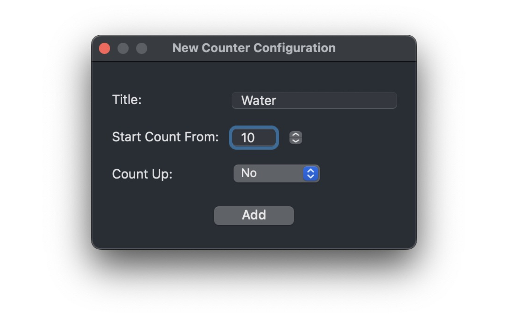
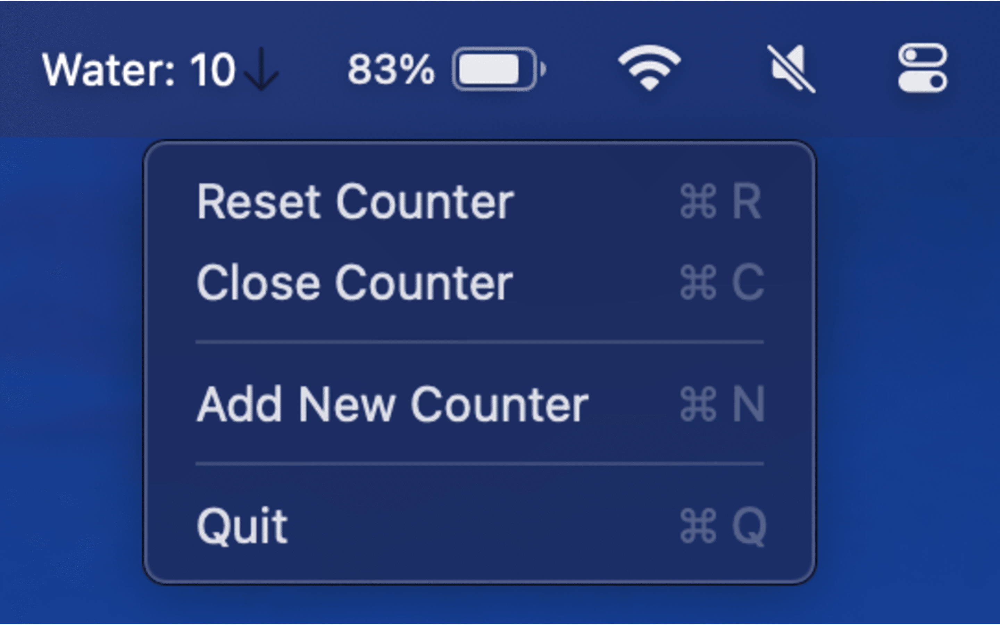

# KeepCount Support Information

**Find it on the Mac App Store: https://apps.apple.com/us/app/keep-count-lite/id6502613753?mt=12**

## Overview
**KeepCount** is a macOS menu bar application designed to let users effortlessly manage and track multiple counters for various tasks directly from the menu bar. It provides a simple, intuitive interface for counting items like daily tasks, project milestones, or personal habits.

### 1. Adding a Counter

### 2. Examples

### 3. Menu

---

## Key Features
- **Multiple Counters:** Users can manage multiple counters simultaneously, each with its unique settings and display.
- **Count Up/Down:** Each counter can be configured to count upwards or downwards, starting from a user-defined initial value.
- **Interactive Configuration:** Users can adjust the title, starting value, and counting direction through a user-friendly configuration window.

## Installation
1. Download "KeepCount" from the Mac App Store.
2. Open the application; there will be a menu to add Counters.
3. Click the menu bar icon for the Counter to add more or reset your counters.

## Usage
- **Updating Counters:** Click on a counter to increase its count based on its configuration (up or down).
- **Resetting Counters:** Select "Reset Counter" from a counter's menu to reset its value to the initial configuration.
- **Closing Counters:** Choose "Close Counter" from a counter's menu to remove it from the menu bar.
- **Adding a New Counter:** Click "Add New Counter" from any counter's menu or start the app to configure a new counter.

## Known Issues
- **Notch Overlap:** In extremely rare cases involving specific macOS configurations and an overcrowded menu bar, new counters might appear behind the notch on MacBook Pros. This behavior is generally managed by macOS and should not occur under typical usage conditions.

## Contact Information
For support, feature requests, or to report issues, please contact:

- **Email:** nishchaykarle@gmail.com
